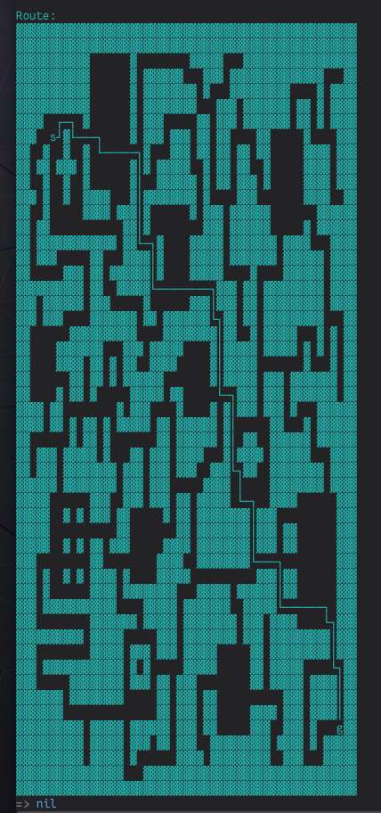

# maze-solver

Solves shortest path from `:s` to `:g` in a maze.

A maze is a vector of vectors. `:w` represents a wall, `:o` represents traversable cell.

A maze:

```clojure
(def test-mapw
  [[:w :w :w :w :w :w :w :w :w :w :w :w :w :w :w :w :w :w :w :w :w :w :w :w :w :w :w :w :w :w :w :w :w :w :w :w :w :w :w :w :w :w :w :w :w :w :w :w :w]
   [:w :w :w :w :w :w :w :w :w :w :o :o :o :o :o :o :w :o :o :o :o :o :o :o :o :w :w :w :w :w :o :o :o :w :w :w :w :w :w :w :w :w :w :w :w :w :w :w :w]
   [:w :w :w :w :w :w :w :w :w :w :o :o :o :o :o :o :w :o :w :w :w :w :w :w :o :o :o :w :w :w :o :w :w :w :w :w :w :w :w :w :w :w :w :w :w :o :o :o :w]
   [:w :w :w :w :w :w :w :w :w :w :o :o :o :o :o :o :w :o :w :w :w :w :w :w :w :w :o :w :o :o :o :w :w :w :w :w :w :w :w :w :o :o :o :o :w :o :w :w :w]
   [:w :w :w :w :w :w :w :w :w :w :o :o :o :o :o :o :w :o :w :w :w :w :w :w :w :w :o :o :o :w :w :w :o :w :w :w :w :w :w :w :o :w :w :o :w :o :w :w :w]
   [:w :w :w :o :o :o :o :o :o :w :o :o :o :o :o :o :w :o :w :w :w :o :o :o :o :o :w :w :o :w :w :w :o :w :w :w :w :w :w :w :o :w :w :o :w :o :w :w :w]
   [:w :w :o :o :s :o :w :o :o :o :o :o :o :o :o :o :w :o :w :w :w :o :w :w :w :o :w :w :o :w :w :o :o :o :o :w :w :o :o :o :o :o :w :o :o :o :o :w :w]
   [:w :o :o :w :o :o :w :o :o :w :o :o :o :o :o :o :o :o :w :o :o :o :w :w :w :o :w :w :o :w :w :o :w :w :o :w :w :o :o :o :o :o :w :w :w :w :o :w :w]
   [:w :o :w :w :o :w :w :w :o :w :o :o :o :o :o :o :w :o :w :o :w :w :w :w :w :o :o :w :o :w :w :o :w :w :o :o :w :o :o :o :o :o :w :w :w :w :o :w :w]
   [:w :o :o :w :o :o :w :o :o :w :o :o :o :o :o :o :w :o :o :o :w :w :w :w :w :w :o :w :o :w :w :o :w :w :w :o :w :o :o :o :o :o :w :w :w :w :o :w :w]
   [:w :w :o :w :o :o :w :o :o :w :w :w :w :o :o :o :w :o :w :w :w :w :w :w :w :w :o :w :o :o :o :o :w :w :w :o :o :o :o :o :o :o :w :w :w :w :o :o :w]
   [:w :o :o :w :o :o :o :o :o :w :w :w :w :o :w :w :w :o :w :o :o :o :o :o :o :w :o :w :w :w :o :w :w :w :w :w :w :o :o :o :o :o :o :o :w :w :w :w :w]
   [:w :o :w :w :o :o :o :o :o :o :o :o :o :o :o :w :w :o :w :o :o :o :o :o :o :o :o :w :w :w :o :w :w :w :w :w :w :o :o :o :o :o :w :o :w :w :w :w :w]
   [:w :o :w :w :w :w :w :w :w :w :w :w :w :w :o :w :w :o :o :o :w :W :W :o :o :w :w :w :w :w :o :w :w :w :w :w :w :w :o :w :w :w :w :o :o :o :w :w :w]
   [:w :o :w :w :w :o :o :o :o :o :w :w :o :o :o :w :w :w :w :o :w :W :W :o :o :w :w :w :w :w :o :w :w :w :w :w :w :w :o :w :w :w :w :w :w :o :w :w :w]
   [:w :o :o :o :o :o :w :w :w :o :w :w :o :w :w :w :w :w :w :o :w :W :W :o :o :w :w :w :w :w :o :o :o :o :w :o :o :o :o :w :w :w :w :w :w :o :w :w :w]
   [:w :w :w :w :w :w :w :w :w :o :w :w :o :o :w :w :w :w :w :o :o :o :o :o :o :o :o :o :o :w :w :w :o :w :w :o :w :w :w :w :w :w :w :w :w :o :w :w :w]
   [:w :w :o :w :w :w :w :w :w :o :w :w :w :o :o :o :o :o :w :o :o :o :o :o :o :w :w :w :o :w :w :w :o :w :w :o :w :w :w :w :w :w :w :w :w :o :w :w :w]
   [:w :w :o :w :w :w :o :o :o :o :w :w :w :w :w :w :w :o :w :w :o :w :w :w :w :w :w :w :o :o :w :w :o :w :w :o :w :w :w :w :w :w :w :w :w :o :o :o :w]
   [:w :o :o :o :o :o :o :w :w :w :w :w :w :w :w :w :w :o :o :o :o :w :w :w :w :w :w :w :w :o :w :w :o :o :w :o :w :w :w :w :w :o :o :o :w :o :w :o :w]
   [:w :o :o :o :o :w :w :w :w :w :w :w :o :o :o :w :w :w :o :w :w :w :w :w :o :o :o :o :w :o :w :w :w :w :w :o :w :w :w :w :w :o :w :o :w :o :w :o :w]
   [:w :o :o :o :o :w :w :w :w :o :w :w :o :w :o :w :w :o :o :w :w :w :w :o :o :o :o :o :w :o :w :w :w :w :w :o :o :o :o :o :o :o :w :o :o :o :w :o :w]
   [:w :o :o :o :o :o :o :w :w :o :w :w :o :w :o :w :w :w :w :w :w :o :o :o :o :o :o :o :w :o :w :w :w :w :w :o :w :w :w :o :w :w :w :w :w :w :w :o :w]
   [:w :o :o :o :o :w :o :w :w :o :w :o :o :o :o :o :w :w :w :w :w :o :w :w :o :o :o :o :o :o :o :o :w :w :w :o :w :w :w :o :w :w :w :w :w :w :w :o :w]
   [:w :w :w :o :w :w :o :o :o :o :o :o :o :o :w :o :w :w :w :o :o :o :o :w :o :o :o :o :w :o :w :o :w :w :w :o :w :w :w :o :w :o :o :o :w :w :w :w :w]
   [:w :w :w :o :w :w :o :w :o :w :w :o :w :o :w :w :w :w :w :o :w :w :o :w :w :w :w :w :w :o :w :o :o :o :o :o :o :w :w :o :o :o :w :o :w :w :w :w :w]
   [:w :o :o :o :o :o :o :w :o :w :w :o :w :o :o :o :o :o :o :o :w :w :o :w :w :w :w :w :w :o :w :o :o :w :w :o :o :w :w :w :w :w :w :o :w :w :w :w :w]
   [:w :o :w :w :w :o :w :w :w :w :w :o :w :o :o :o :w :w :o :w :w :w :o :w :w :w :w :o :o :o :w :o :w :w :w :w :o :w :w :w :w :w :w :o :o :o :w :w :w]
   [:w :o :w :w :w :o :w :w :w :w :w :w :w :w :o :w :w :w :o :w :w :w :o :w :w :w :o :o :w :w :w :o :o :w :w :o :o :w :w :w :w :w :w :w :w :o :w :w :w]
   [:w :w :w :w :w :o :w :w :w :w :w :w :w :w :o :w :w :w :o :w :w :w :o :o :o :o :o :w :w :w :w :o :o :o :o :o :o :w :w :w :w :w :w :w :w :o :w :w :w]
   [:w :w :w :w :o :o :o :o :o :o :w :w :w :o :o :w :w :w :o :w :w :w :o :w :w :o :w :w :w :w :w :o :o :o :o :o :o :w :w :w :w :o :o :o :o :o :o :w :w]
   [:w :w :w :w :o :o :w :o :w :o :w :w :w :o :w :w :o :o :o :o :o :w :o :w :w :o :w :w :w :w :w :w :w :w :o :w :w :w :o :o :o :o :o :o :o :o :o :w :w]
   [:w :w :w :w :o :o :o :o :o :o :o :o :o :o :w :w :o :o :o :o :o :o :o :w :w :o :w :w :w :w :w :w :w :w :o :w :w :w :o :w :w :o :o :o :o :o :o :w :w]
   [:w :w :w :w :o :o :w :o :w :o :w :w :o :w :w :w :o :o :o :o :o :w :w :w :w :o :w :w :w :w :w :w :w :w :o :w :w :w :o :w :w :o :o :o :o :o :o :w :w]
   [:w :w :o :o :o :o :o :o :o :o :w :w :o :o :o :o :o :o :o :o :w :w :w :w :o :o :w :w :w :w :w :w :w :w :o :o :o :o :o :o :o :o :o :o :o :o :o :w :w]
   [:w :w :o :w :o :o :w :o :w :o :w :w :w :w :o :w :o :o :o :o :w :w :w :w :w :o :o :o :o :o :o :o :o :o :o :w :w :w :o :w :w :o :o :o :o :o :o :w :w]
   [:w :w :o :w :o :o :o :o :o :o :w :w :w :w :o :w :w :w :w :w :w :w :w :o :o :o :w :w :w :w :w :o :w :w :w :w :w :w :o :w :w :o :o :o :o :o :o :w :w]
   [:w :w :o :w :w :w :w :w :w :w :w :w :w :w :o :o :o :o :w :w :w :w :w :o :w :w :w :w :w :w :w :o :o :w :w :w :w :w :o :o :o :o :o :o :o :o :o :w :w]
   [:w :w :o :o :o :o :o :o :o :o :w :w :w :w :w :w :w :o :w :w :w :w :w :o :w :w :w :w :w :w :w :w :o :w :w :w :o :w :w :w :w :o :o :o :o :o :o :w :w]
   [:w :w :w :w :w :w :w :w :w :o :w :w :w :w :w :o :o :o :o :o :w :w :w :o :w :w :w :w :w :w :w :w :o :w :w :w :o :w :w :w :w :w :w :w :w :w :o :w :w]
   [:w :w :o :o :o :o :o :o :o :o :w :w :w :w :w :o :w :w :w :o :w :w :w :o :w :w :w :w :w :o :o :o :o :o :w :w :o :w :w :w :w :w :w :w :w :w :o :w :w]
   [:w :w :o :w :w :w :w :w :w :w :w :w :w :w :w :o :w :o :w :o :o :o :o :o :w :w :w :w :w :o :o :o :o :o :w :w :o :w :w :w :w :w :o :o :o :o :o :o :w]
   [:w :w :o :o :o :o :o :w :w :w :w :w :w :w :w :o :w :w :w :o :w :w :o :w :w :w :o :o :o :o :o :o :o :o :w :w :o :w :w :w :w :w :o :w :w :w :w :o :w]
   [:w :w :w :w :w :w :o :w :w :w :w :w :w :w :w :o :o :o :o :o :w :w :o :w :w :w :o :w :w :o :o :o :o :o :o :o :o :o :o :w :w :w :o :w :w :w :w :o :w]
   [:w :w :w :w :w :w :o :o :o :o :o :o :o :o :o :o :o :o :o :o :w :w :o :w :w :w :o :w :w :o :o :o :o :o :w :w :w :w :o :w :w :w :o :w :w :w :w :o :w]
   [:w :w :w :w :w :w :w :w :w :o :w :w :w :w :w :o :w :w :w :w :w :w :o :w :w :w :o :w :w :o :o :o :o :o :w :w :w :o :o :w :w :w :o :w :o :o :o :g :w]
   [:w :w :w :w :w :w :w :w :w :o :w :w :w :w :w :o :w :w :w :o :w :w :o :w :w :w :o :o :w :w :w :w :w :w :w :w :w :o :w :w :w :w :o :w :o :w :w :w :w]
   [:w :w :w :w :w :w :w :w :w :o :w :w :w :w :w :o :w :o :o :o :o :o :o :w :w :w :w :o :w :w :w :w :w :w :w :w :w :o :o :w :w :w :o :o :o :w :w :w :w]
   [:w :w :w :w :w :w :w :w :w :w :w :w :w :w :w :o :o :o :w :w :w :w :w :w :w :w :w :w :w :w :w :w :w :w :w :w :w :w :w :w :w :w :w :w :w :w :w :w :w]])
```

Solving:

```clojure
(print-map-and-route* test-mapw)
```
Solution:



